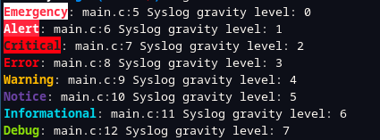

# C-Utils

List of C-utils used in my C project in Epita

## Requirements
- Pyhton3
- Compiledb

## Log

Colored log utils, every log are writted in stderr. It can also use syslog:

### Macro prototype:
```c
LOG(lvl, ...)
```

### Example:
```c
  LOG(L_EMERGENCY, "Syslog gravity level: %d", L_EMERGENCY);
  LOG(L_ALERT, "Syslog gravity level: %d", L_ALERT);
  LOG(L_CRITICAL, "Syslog gravity level: %d", L_CRITICAL);
  LOG(L_ERROR, "Syslog gravity level: %d", L_ERROR);
  LOG(L_WARNING, "Syslog gravity level: %d", L_WARNING);
  LOG(L_NOTICE, "Syslog gravity level: %d", L_NOTICE);
  LOG(L_INFORMATIONAL, "Syslog gravity level: %d", L_INFORMATIONAL);
  LOG(L_DEBUG, "Syslog gravity level: %d", L_DEBUG);
```

### Output:


### Syslog
You can make log also writted in syslog by defining **L_SYSLOG**. Don't forget to use openlog function before.

## Aliases

Rename attribute and type

### Attributes

| Original attribute          | New Name   |
|:---------------------------:|:----------:|
| \_\_attribute\_\_((packed)) | \_\_packed |
| \_\_attribute\_\_((unused)) | \_\_unused |

### Type

| Original type | New Name | Size (Bit) | Signed |
|:-------------:|:--------:|:----------:|:------:|
| int8\_t        | i8       | 8          | Yes    |
| int16\_t       | i16      | 16         | Yes    |
| int32\_t       | i32      | 32         | Yes    |
| int64\_t       | i64      | 64         | Yes    |
| uint8\_t       | u8       | 8          | No     |
| uint16\_t      | u16      | 16         | No     |
| uint32\_t      | u32      | 32         | No     |
| uint64\_t      | u64      | 64         | No     |

## Slice

Utils for array manipulation

### Slice structure

```c
struct slice_type
{
  type *data;
  size_t len;
};
```

### Maro list

```c
SLICE_DEF(type, name) //Used to define a new slice type.

SLICE_MAKE(type, data, len) //Used to init a slice

SLICE_VOID(slice) //Used to create a void slice from a typed slice

SLICE_SUB(slice, start, end) //Used to create a sub slice from another slice

SLICE_SHIFT(slice, amount) //Used to create a shifted slice from another slice

SLICE_MEMSET(slice, val) //Used to memset a value on a slice

SLICE_MEMCPY(dst, src) //Used to memcpy a slice in another slice

SLICE_EQUAL(dst, src) //Used to check equality between two slices

SLICE_PRINT(slice) //Used to print slice

SLICE_CMP_PRINT(ref, out) //Used to print differences between two slices
```

### Default slice type

| Type    | Name                  |
|:-------:|:---------------------:|
| u8      | struct slice\_u8      |
| u32     | struct slice\_u32     |
| u64     | struct slice\_u64     |
| i64     | struct slice\_i64     |
| int     | struct slice\_int     |
| char *  | struct slice\_string  |
| double  | struct slice\_double  |
| bool    | struct slice\_bool    |
| size\_t | struct slice\_size\_t |

### Example

```c
struct foo {
  int data;
  char data2;
};

SLICE_DEF(struct foo, foo)

int main(void) {

  struct foo bar[15] = {0};
  struct slice_foo slice = SLICE_MAKE(struct slice_foo, bar, 15);

  struct foo *bar2 = calloc(sizeof(struct foo), 16);
  struct slice_foo slice2 = SLICE_MAKE(struct slice_foo, bar2, 16);

  for (size_t i = 0; i < slice2.len; i++) {
    slice2.data[i].data = 1;
  }

  free(bar2);

  return 0;
}
```
